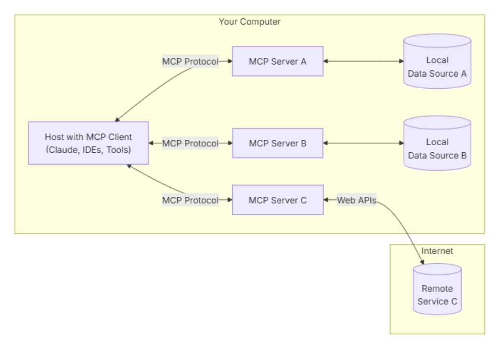

# MCP

模型上下文协议（MCP）是一个创新的开源协议，它重新定义了大语言模型（LLM）与外部世界的互动方式。MCP 提供了一种标准化方法，使任意大语言模型能够轻松连接各种数据源和工具，实现信息的无缝访问和处理。MCP 就像是 AI 应用程序的 USB-C 接口，为 AI 模型提供了一种标准化的方式来连接不同的数据源和工具。

## 整体架构

MCP 的核心遵循客户端-服务器架构，其中主机应用程序可以连接到多个MCP Server服务器：

- **MCP 主机**：像 Claude Desktop、IDE 或 AI 工具这样的程序，需要通过 MCP 访问数据
- **MCP 客户端**：与服务器保持 1:1 连接的协议客户端
- **MCP 服务器**：轻量级程序，每个程序都通过标准化模型上下文协议公开特定功能
- **本地数据源**：MCP 服务器可以安全访问的您计算机上的文件、数据库和服务
- **远程服务**：MCP 服务器可以通过互联网（例如通过 API）连接到的外部系统

## 构建一个MCP Server

### MCP的核心概念

MCP 服务器可以提供三种主要类型的功能：

- **资源**：客户端可以读取的类似**文件的数据**（例如 API 响应或文件内容）
- **工具**：**可由 LLM 调用的函数**（经用户批准）
- **提示**：**预先编写的模板，帮助用户完成特定任务**

小王的理解：

MCP相当于是给大模型一个可以读取标准格式数据的工具，或者给大模型决策选择的工具方案，或者一个模板。

Agent相当于代替大模型去

