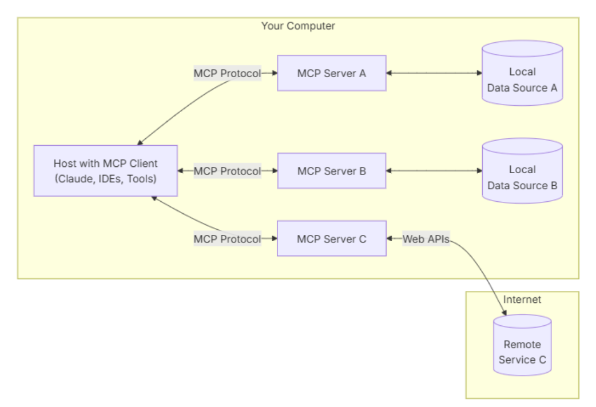
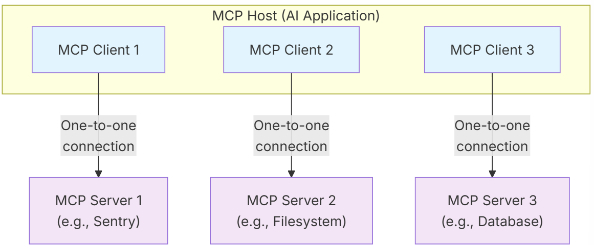

# MCP

模型上下文协议（MCP）是一个创新的开源协议，它重新定义了大语言模型（LLM）与外部世界的互动方式。MCP 提供了一种标准化方法，使任意**大语言模型能够轻松连接各种数据源和工具，实现信息的无缝访问和处理。**MCP 就像是 AI 应用程序的 USB-C 接口，为 AI 模型提供了一种标准化的方式来连接不同的数据源和工具。

## 整体架构

MCP 的核心遵循**客户端-服务器**架构，其中主机应用程序可以连接到多个MCP Server服务器：

- **MCP 主机**：像 Claude Desktop、IDE 或 AI 工具这样的程序，需要通过 MCP 访问数据
  - 功能：协调和管理一个或多个MCP客户端
- **MCP 客户端**：与服务器保持 1:1 连接的协议客户端
  - 每一个mcp连接都有一个mcp客户端来与mcp服务端建立连接
- **MCP 服务器**：轻量级程序，每个程序都通过标准化MCP协议公开特定功能
- **本地数据源**：MCP 服务器可以安全访问的您计算机上的文件、数据库和服务
- **远程服务**：MCP 服务器可以通过互联网（例如通过 API）连接到的外部系统

## 图层

MCP由两层组成：

- 数据层：定义基于JSON-RPC的客户端-服务器通信协议，包括生命周期管理、核心原语，如工具、资源、提示和通知。
- 传输层：定义实现客户端和服务器之间数据交换的通信机制和渠道，包括传输特定的连接建立、消息框架和授权。

### 数据层

数据层实现了基于JSON-RPC 2.0的交换协议，定义了消息结构和语义。该层包括：

- **生命周期管理**：处理客户端和服务器之间的连接初始化、功能协商和连接终止
- **服务器功能**：使服务器能够提供核心功能，包括用于 AI 操作的工具、用于上下文数据的资源以及从客户端到交互模板的提示
- **客户端功能**：使服务器能够要求客户端从主机 LLM 进行采样，从用户那里获取输入，并将消息记录到客户端
- **实用功能**：支持附加功能，例如实时更新通知和长期运行操作的进度跟踪

## 构建一个MCP Server

### MCP的核心概念

MCP 服务器可以提供三种主要类型的功能：

- **资源**：客户端可以读取的类似**文件的数据**（例如 API 响应或文件内容）
- **工具**：**可由 LLM 调用的函数**（经用户批准）
- **提示**：**预先编写的模板，帮助用户完成特定任务**

小王的理解：

MCP相当于是给大模型一个可以读取标准格式数据的工具，或者给大模型决策选择的工具方案，或者一个模板。

Agent相当于代替大模型去

