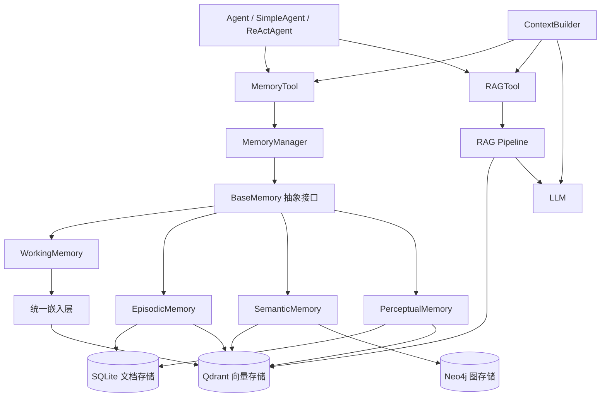
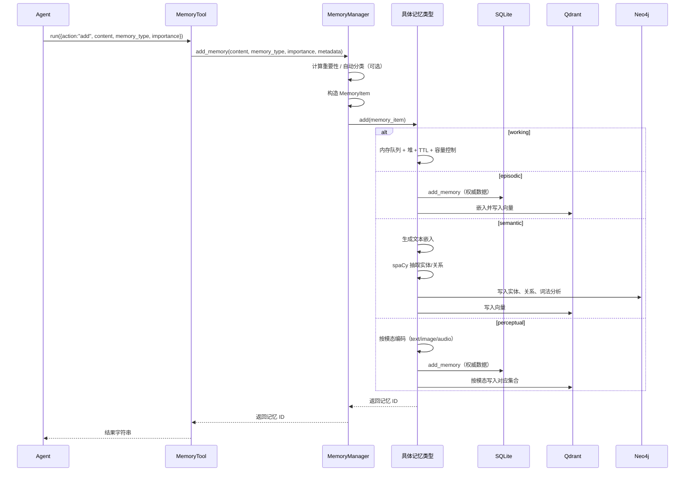
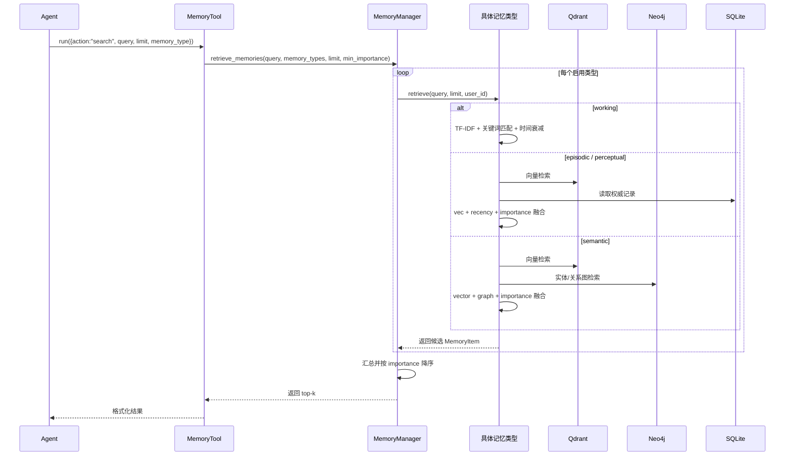
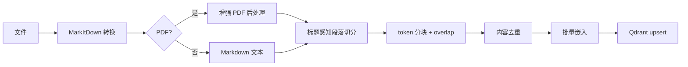

# HelloAgents 记忆管理设计原理与流程分析

  

> 本文基于 `hello_agents/memory/`、`hello_agents/tools/builtin/memory_tool.py`、`hello_agents/tools/builtin/rag_tool.py`、`hello_agents/context/builder.py` 等源码整理，梳理 HelloAgents 记忆系统的分层设计、核心数据结构、写入/检索/生命周期流程、RAG 流程以及上下文工程集成方式。

  

## 一、总体定位与核心思想

  

HelloAgents 是一个教学友好的多智能体框架，其核心设计原则是：

  

> 除了核心的 Agent 类，一切皆为 Tools。

  

因此，记忆（Memory）和检索增强生成（RAG）在这个项目里不是独立运行的系统，而是被封装成符合 `Tool` 基类规范的 `MemoryTool` 和 `RAGTool`，可以被 `SimpleAgent`、`ReActAgent` 等 Agent 直接注册和调用。

  

同时，项目在 `hello_agents/memory/` 下保留了一套完整的记忆核心实现，形成：

  

- **工具层**：`MemoryTool`、`RAGTool`，面向 Agent 的统一调用入口。

- **记忆核心层**：`MemoryManager`、`BaseMemory`、`MemoryItem`、`MemoryConfig`。

- **记忆类型层**：工作记忆、情景记忆、语义记忆、感知记忆。

- **存储层**：SQLite、Qdrant、Neo4j。

- **嵌入层**：统一的文本嵌入提供器，支持本地、DashScope、TF-IDF 三级降级。

- **RAG 层**：文档加载、分块、向量索引、检索、重排、片段合并。

- **上下文工程层**：`ContextBuilder` 的 GSSC 流水线。

  

整体架构可以概括为：

  



  

## 二、模块地图

  

| 模块 | 文件 | 职责 |

|------|------|------|

| 工具入口 | `hello_agents/tools/builtin/memory_tool.py` | 记忆操作统一入口 |

| 工具入口 | `hello_agents/tools/builtin/rag_tool.py` | RAG 操作统一入口 |

| 核心管理 | `hello_agents/memory/manager.py` | 多类型记忆协调、生命周期管理 |

| 基础抽象 | `hello_agents/memory/base.py` | `MemoryItem`、`MemoryConfig`、`BaseMemory` |

| 工作记忆 | `hello_agents/memory/types/working.py` | 短期上下文，纯内存 |

| 情景记忆 | `hello_agents/memory/types/episodic.py` | 事件序列，SQLite + Qdrant |

| 语义记忆 | `hello_agents/memory/types/semantic.py` | 知识/概念，Qdrant + Neo4j |

| 感知记忆 | `hello_agents/memory/types/perceptual.py` | 多模态，SQLite + Qdrant |

| 文档存储 | `hello_agents/memory/storage/document_store.py` | SQLite 权威存储 |

| 向量存储 | `hello_agents/memory/storage/qdrant_store.py` | Qdrant 向量检索 |

| 图存储 | `hello_agents/memory/storage/neo4j_store.py` | Neo4j 知识图谱 |

| 嵌入 | `hello_agents/memory/embedding.py` | 统一嵌入与降级 |

| RAG | `hello_agents/memory/rag/pipeline.py` | 文档加载、索引、检索、重排 |

| 文档分块 | `hello_agents/memory/rag/document.py` | 文档与块的数据结构和分块器 |

| 上下文工程 | `hello_agents/context/builder.py` | GSSC 上下文构建流水线 |

| 数据库配置 | `hello_agents/core/database_config.py` | Qdrant/Neo4j 配置 |

  

## 三、核心数据结构

  

### 1. MemoryItem

  

所有记忆类型的统一数据单元，定义在 `base.py`：

  

| 字段 | 类型 | 说明 |

|------|------|------|

| `id` | `str` | 记忆 ID |

| `content` | `str` | 记忆内容 |

| `memory_type` | `str` | 记忆类型 |

| `user_id` | `str` | 所属用户 |

| `timestamp` | `datetime` | 时间戳 |

| `importance` | `float` | 重要性，0–1，默认 0.5 |

| `metadata` | `dict` | 扩展元数据 |

  

### 2. MemoryConfig

  

关键配置项：

  

| 字段 | 默认值 | 说明 |

|------|--------|------|

| `storage_path` | `./memory_data` | SQLite 数据目录 |

| `max_capacity` | `100` | 总容量参考值 |

| `importance_threshold` | `0.1` | 重要性阈值 |

| `decay_factor` | `0.95` | 时间衰减因子 |

| `working_memory_capacity` | `10` | 工作记忆条目上限 |

| `working_memory_tokens` | `2000` | 工作记忆 token 上限 |

| `working_memory_ttl_minutes` | `120` | 工作记忆 TTL，分钟 |

| `perceptual_memory_modalities` | `["text","image","audio","video"]` | 支持模态 |

  

### 3. 各记忆类型辅助类

  

- `Episode`：情景记忆中的一个事件，包含 `session_id`、`context`、`outcome` 等。

- `Entity` / `Relation`：语义记忆的实体和关系，用于知识图谱。

- `Perception`：感知记忆中的感知数据，包含模态、编码向量、哈希。

- `Document` / `DocumentChunk`：RAG 文档和分块。

- `ContextPacket`：上下文工程中的候选信息包，包含内容、token 数、相关性分数。

  

## 四、设计原理

  

### 1. 分层与统一接口

  

`BaseMemory` 定义了所有记忆类型的公共接口：

  

- `add`

- `retrieve`

- `update`

- `remove`

- `has_memory`

- `clear`

- `get_stats`

- `forget`

  

`MemoryManager` 通过字典 `self.memory_types` 统一管理启用类型，上层 `MemoryTool` 只与 `MemoryManager` 交互，不直接接触具体记忆实现。

  

### 2. 认知启发的多类型记忆

  

项目借鉴人类记忆模型，把记忆分为四类：

  

- **工作记忆**：当前会话的短期上下文，容量小、时效短、纯内存。

- **情景记忆**：具体事件和交互历史，按时间组织，支持会话、模式识别。

- **语义记忆**：抽象知识、用户画像、概念与关系，跨场景可复用。

- **感知记忆**：文本、图像、音频等多模态数据。

  

### 3. 权威源 + 索引的混合存储

  

大多数持久化记忆采用“权威数据 + 可重建索引”的模式：

  

- SQLite 保存完整记录，作为权威数据源。

- Qdrant 保存向量，用于相似度召回。

- Neo4j 保存实体/关系，用于图检索和推理。

  

这样即使向量索引丢失或图数据重建，SQLite 中仍保留原始内容。

  

### 4. 统一嵌入与优雅降级

  

`embedding.py` 提供线程安全的单例 `get_text_embedder()`，通过环境变量决定首选模型，并自动降级：

  

```text

dashscope → local（sentence-transformers 或 transformers）→ tfidf

```

  

代码中的默认首选是 `dashscope`，本地默认模型为 `sentence-transformers/all-MiniLM-L6-v2`。

  

感知记忆中的图像/音频则进一步支持：

  

```text

CLIP / CLAP（可选）→ 确定性 SHA-256 哈希向量

```

  

哈希向量只能用于“同源文件精确匹配”，不支持跨模态语义检索。

  

### 5. 生命周期管理

  

系统提供三类遗忘策略和整合机制：

  

- `importance_based`：删除低于重要性阈值的记忆。

- `time_based`：删除超过保留天数的记忆。

- `capacity_based`：超过容量时删除低优先级/低重要性记忆。

- `consolidate`：把高重要性的短期记忆（如 working）提升为长期记忆（如 episodic），并小幅提高重要性。

  

工作记忆额外有 TTL 自动过期机制，以及数量、token 双容量限制。

  

### 6. 检索融合排序

  

不同记忆类型采用“相似度 + 近因/图信号 + 重要性加权”的组合评分，具体公式见后文“关键评分公式”。

  

### 7. 单例与连接复用

  

- `SQLiteDocumentStore` 按绝对路径缓存实例，避免同一数据库重复初始化。

- `QdrantConnectionManager` 按 `(url, collection_name)` 缓存实例，避免重复连接。

- `embedding.py` 使用全局单例嵌入模型。

  

## 五、记忆添加流程

  



  

要点：

  

1. `MemoryTool._add_memory` 会生成会话 ID，并把 `session_id`、`timestamp` 写入 metadata；感知记忆还会注入 `modality` 和 `raw_data`。

2. `MemoryManager.add_memory` 默认会做自动分类，但 `MemoryTool` 显式传入 `auto_classify=False`，使用用户指定的类型。

3. 情景、感知、语义记忆在写入权威数据后异步/同步写入向量索引；向量写入失败通常不会阻断权威数据写入（情景和感知会捕获异常）。

  

## 六、记忆检索流程

  



  

要点：

  

1. `MemoryManager` 先按类型平均分配 `per_type_limit`，分别召回后统一按 `importance` 降序，再截取 `limit` 条。

2. 每个类型内部已经有自己的相关性排序；Manager 层只做二次按重要性排序，因此最终结果偏向“重要”而不是“最相关”。

3. 情景、语义、感知检索支持通过 `user_id` 过滤。

  

## 七、四类记忆详解

  

### 1. WorkingMemory

  

- **存储**：纯内存 `List[MemoryItem]` + 优先队列 `memory_heap`。

- **容量控制**：条目数不超过 `working_memory_capacity`，token 数不超过 `working_memory_tokens`。

- **TTL**：默认 120 分钟，检索和添加时惰性清理。

- **检索**：先尝试 TF-IDF + 余弦相似度，再结合关键词匹配；最终分数乘以时间衰减和重要性权重。

- **遗忘**：TTL 过期 + 三种策略。

  

### 2. EpisodicMemory

  

- **存储**：SQLite 权威记录 + Qdrant 向量索引 + 内存缓存 `episodes`/`sessions`。

- **结构化信息**：`session_id`、`context`、`outcome`、`participants`、`tags`。

- **检索**：Qdrant 向量召回，再用 `0.8*vec + 0.2*recency` 作为基础分，乘以重要性权重；无向量命中时回退到关键词匹配。

- **额外能力**：按会话取事件、时间线视图、基于关键词/上下文的简单模式识别。

  

### 3. SemanticMemory

  

- **存储**：Qdrant 向量 + Neo4j 图 + 内存缓存。

- **写入**：文本嵌入 → spaCy 抽取实体 → 共现关系入图 → 向量入 Qdrant。

- **图构建**：除了命名实体，还会把词元、概念、依存关系写入 Neo4j（`TOKEN`、`CONCEPT`、依存边）。

- **检索**：向量检索和图检索并行，按 `0.7*vector + 0.3*graph` 融合，再乘重要性权重，最后做 softmax 概率归一化。

- **注意**：语义记忆依赖 Qdrant 和 Neo4j 都可用；初始化时任一连接失败会抛异常。

  

### 4. PerceptualMemory

  

- **存储**：SQLite 权威记录 + Qdrant 多模态向量集合 + 内存缓存。

- **按模态分集合**：`<base>_perceptual_text`、`<base>_perceptual_image`、`<base>_perceptual_audio`，避免维度冲突。

- **编码策略**：

  - 文本：统一文本嵌入。

  - 图像：优先 CLIP，缺失则 SHA-256 哈希向量。

  - 音频：优先 CLAP，缺失则 SHA-256 哈希向量。

- **检索**：同模态向量检索 + `0.8*vec + 0.2*recency`，乘以重要性权重；支持 `target_modality` 过滤。

- **跨模态**：需 CLIP/CLAP 支持；哈希回退仅支持同源文件匹配。

  

## 八、RAG 流程

  

RAGTool 的核心数据流是：

  

```text

文档/文本 → 解析与分块 → 嵌入 → Qdrant 向量索引 → 检索 → LLM 增强问答

```

  

### 1. 文档写入

  



  

实现细节：

  

- `_convert_to_markdown` 使用 MarkItDown；PDF 走增强处理，包含去噪、短行合并、段落重组。

- `_split_paragraphs_with_headings` 保留标题层级，生成 `heading_path`。

- `_chunk_paragraphs` 按近似 token 数分块，并通过保留尾部 token 实现重叠。

- 每个块生成 `chunk_id` 和 `content_hash`，通过内容哈希去重。

- 写入 Qdrant 时打上 `memory_type="rag_chunk"`、`is_rag_data=True`、`data_source="rag_pipeline"`、`rag_namespace` 等标签，便于与记忆向量隔离。

  

### 2. 检索与问答

  

`RAGTool` 提供 `search` 和 `ask`：

  

- `search`：向量检索，返回带来源和相似度的片段。

- `ask`：检索 → 组装上下文 → 构造系统/用户提示词 → 调用 `HelloAgentsLLM` 生成答案 → 附加引用。

  

高级检索 `search_advanced` 支持：

  

- **MQE（Multi-Query Expansion）**：用 LLM 生成多个等价查询。

- **HyDE**：让 LLM 先生成假设性答案段落，用该段落做向量检索。

  

`pipeline.py` 中还提供了一系列排序/合并函数：

  

- `compute_graph_signals_from_pool`：同文档密度 + 邻近 chunk 距离，作为图信号。

- `rank`：`0.7*vector + 0.3*graph`。

- `rerank_with_cross_encoder`：可选 cross-encoder 重排。

- `merge_snippets_grouped`：按文档分组、带引用编号合并片段。

- `compress_ranked_items`：限制每文档片段数，合并相邻片段。

  

注意：当前 `create_rag_pipeline` 返回的 `search_advanced` 直接返回扩展后的原始向量命中，`RAGTool._ask/_search` 也是直接格式化这些原始命中；上述重排/合并函数虽已导出，但未默认串入 `RAGTool` 的主问答链路。

  

## 九、上下文工程集成：GSSC 流水线

  

`ContextBuilder` 实现 Gather-Select-Structure-Compress 四阶段：

  


  

1. **Gather**：

   - P0：系统指令。

   - P1：记忆工具检索任务状态和当前查询相关记忆。

   - P2：RAG 工具检索事实证据。

   - P3：最近 10 条对话历史。

   - 额外 `ContextPacket`。

  

2. **Select**：

   - 关键词重叠计算相关性。

   - 指数衰减计算近因性。

   - 复合分 `0.7*relevance + 0.3*recency`。

   - 系统指令固定纳入，其余按 `min_relevance` 和 token 预算筛选。

  

3. **Structure**：

   - `[Role & Policies]`、`[Task]`、`[State]`、`[Evidence]`、`[Context]`、`[Output]` 结构化模板。

  

4. **Compress**：

   - 超过可用预算时按行截断；注释中说明实际系统可替换为 LLM 摘要。

  

## 十、关键评分公式

  

以下均来自源码实现：

  

### 工作记忆

  

```text

time_decay = max(0.1, decay_factor^(hours_passed / 6))

importance_weight = 0.8 + importance * 0.4

  

if vector_score > 0:

    base_relevance = vector_score * 0.7 + keyword_score * 0.3

else:

    base_relevance = keyword_score

  

final = base_relevance * time_decay * importance_weight

```

  

### 情景 / 感知记忆

  

```text

recency = 1 / (1 + age_days)

base_relevance = vector_score * 0.8 + recency * 0.2

final = base_relevance * (0.8 + importance * 0.4)

```

  

### 语义记忆

  

```text

graph_score = entity_score * 0.6

            + entity_density * 0.2

            + relation_density * 0.2

  

base_relevance = vector_score * 0.7 + graph_score * 0.3

combined_score = base_relevance * (0.8 + importance * 0.4)

```

  

随后对 `combined_score` 做 softmax 归一化得到 `probability`。

  

### RAG 排序

  

```text

graph_signal = same_doc_density + proximity（同文档内相邻块距离）

score = vector_score * 0.7 + graph_signal * 0.3

```

  

## 十一、配置与环境变量

  

### 嵌入模型

  

```bash

EMBED_MODEL_TYPE=dashscope | local | tfidf

EMBED_MODEL_NAME=<模型名>

EMBED_API_KEY=<API Key>

EMBED_BASE_URL=<兼容 OpenAI 的 base URL>

```

  

### 向量数据库

  

```bash

QDRANT_URL=<云端或自定义 URL>

QDRANT_API_KEY=<API Key>

QDRANT_COLLECTION=hello_agents_vectors

QDRANT_DISTANCE=cosine

QDRANT_HNSW_M=32

QDRANT_HNSW_EF_CONSTRUCT=256

QDRANT_SEARCH_EF=128

QDRANT_SEARCH_EXACT=0

```

  

### 图数据库

  

```bash

NEO4J_URI=bolt://localhost:7687

NEO4J_USERNAME=neo4j

NEO4J_PASSWORD=hello-agents-password

NEO4J_DATABASE=neo4j

```

  

### 多模态

  

```bash

CLIP_MODEL=openai/clip-vit-base-patch32

CLAP_MODEL=laion/clap-htsat-unfused

```

  

## 十二、已知问题与注意事项

  

1. **`auto_record_conversation` 与 `add_knowledge` 传参不匹配**

   - `MemoryTool._add_memory` 签名只接受 `content`、`memory_type`、`importance`、`file_path`、`modality`。

   - `auto_record_conversation` 额外传入 `type`、`conversation_id`，`add_knowledge` 额外传入 `knowledge_type`、`source`，会导致 `TypeError`。

  

2. **`min_importance` 过滤未真正生效**

   - `MemoryManager.retrieve_memories` 将 `min_importance` 传给各类型，但 working/episodic/semantic/perceptual 的 `retrieve` 并不消费该参数（episodic 读的是 `importance_threshold`）。

  

3. **`EpisodicMemory.get_all()` 引用了不存在的 `episode.metadata`**

   - `Episode` 对象只有 `context`，没有 `metadata` 属性，调用 `get_all()` 可能抛出 `AttributeError`。

  

4. **`PerceptualMemory.update()` 使用了不存在的 `self.vector_store`**

   - 感知记忆保存的是 `self.vector_stores`（字典），更新时引用 `self.vector_store`，异常被静默吞掉，导致向量更新失败但不报错。

  

5. **外部服务依赖较强**

   - Episodic、Semantic、Perceptual 在初始化时就会连接 Qdrant，Semantic 还要求 Neo4j 可用；缺少服务时不能优雅降级为纯内存模式。

  

6. **文档/示例与代码签名不一致**

   - 文档和 `examples/chapter08_memory_rag.py` 中使用了 `RAGTool(embedding_model="local")`、`RAGTool(retrieval_strategy="vector")`，但当前 `RAGTool.__init__` 不接受这些参数。

  

7. **语义记忆的 `clear()` 会清空整个 Qdrant/Neo4j**

   - `SemanticMemory.clear` 调用的是存储层的整库清空，而非只删除 semantic 类型，多类型共享同一集合时需注意隔离。

  

## 十三、总结

  

HelloAgents 的记忆管理可以概括为：

  

- 用 `MemoryTool` 和 `RAGTool` 把记忆能力接入 Agent，符合“一切皆工具”的框架理念。

- 用四类记忆模拟人类认知中的短期、事件、语义和多模态记忆。

- 用 SQLite 保证权威数据持久化，用 Qdrant 提供向量召回，用 Neo4j 提供实体关系推理。

- 用统一嵌入层和三级降级机制平衡效果与可用性。

- 用重要性、时间衰减、遗忘、整合等机制模拟记忆的生命周期。

- 用 `ContextBuilder` 的 GSSC 流水线把记忆和 RAG 结果转化为 LLM 的上下文。

  

整体设计清晰、层次分明，适合教学和理解多智能体记忆系统的实现思路；但在部分边界路径、参数一致性和外部服务降级方面仍有改进空间。