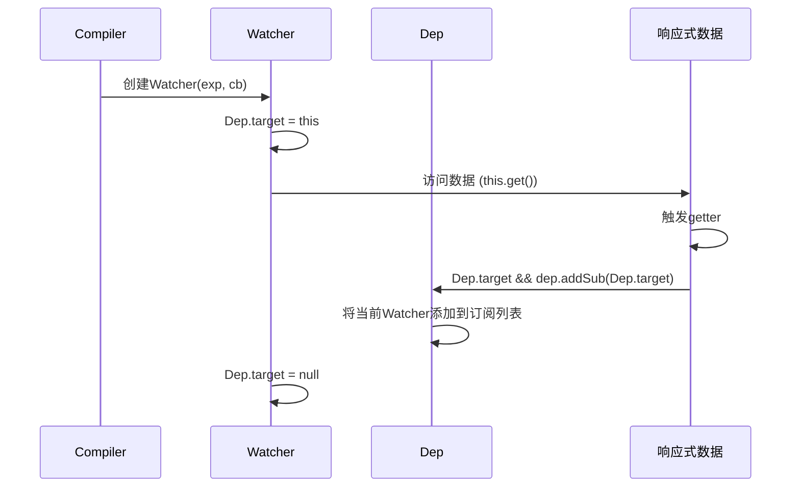

# Vue.js模板编译与依赖收集详解

## 依赖收集的核心概念

依赖收集是Vue响应式系统的关键机制，它确保当数据变化时，只有依赖该数据的视图部分会更新，而不是整个页面重新渲染。

## 模板编译与依赖收集的流程

### 1. 模板编译阶段

当Vue实例创建时，编译器(Compiler)会解析模板，识别其中的插值表达式和指令：

```javascript
// 编译文本节点中的插值表达式 {{name}}
Compiler.prototype.compileText = function(node) {
  const text = node.textContent;
  const reg = /\{\{(.*)\}\}/;
  
  if (reg.test(text)) {
    const exp = RegExp.$1.trim();  // 提取表达式，如 'name'
    node.textContent = '';
    
    // 创建文本节点并添加订阅者
    this.bindText(node, exp);  // 这里会触发依赖收集
  }
};
```

### 2. 依赖收集的关键步骤

依赖收集发生在`bindText`方法中，这里会创建Watcher实例：

```javascript
Compiler.prototype.bindText = function(node, exp) {
  const updateFn = (value) => {
    node.textContent = value;
  };
  
  // 创建订阅者 - 这里是依赖收集的关键点
  new Watcher(this.vm, exp, updateFn);
  
  // 初始化文本
  const value = parsePath(this.vm, exp);
  updateFn(value);
};
```

### 3. Watcher创建与依赖收集

当创建Watcher实例时，会触发依赖收集过程：

```javascript
function Watcher(vm, exp, cb) {
  this.vm = vm;
  this.exp = exp;  // 表达式，如 'name'
  this.cb = cb;    // 更新回调函数
  this.value = undefined;
  
  // 关键步骤：将当前订阅者指向自己
  Dep.target = this;
  
  // 访问数据，触发getter，进行依赖收集
  if (exp) {
    this.value = this.get();  // 这里会触发数据的getter
  }
  
  // 重置Dep.target
  Dep.target = null;
}
```

### 4. 数据访问触发依赖收集

当调用`this.get()`方法访问数据时，会触发数据的getter：

```javascript
Watcher.prototype.get = function() {
  // 解析表达式，获取值
  const value = parsePath(this.vm, this.exp);  // 访问 vm.name
  return value;
};

// parsePath函数会逐层访问对象属性
function parsePath(obj, path) {
  const segments = path.split('.');
  for (let i = 0; i < segments.length; i++) {
    if (!obj) return;
    obj = obj[segments[i]];  // 这里会触发属性的getter
  }
  return obj;
}
```

### 5. 数据属性的getter进行依赖收集

当访问数据属性时，会触发我们在`defineReactive`中定义的getter：

```javascript
function defineReactive(obj, key, val) {
  // 递归观察子对象
  observe(val);
  
  // 创建依赖收集器
  const dep = new Dep();
  
  Object.defineProperty(obj, key, {
    enumerable: true,
    configurable: true,
    get() {
      // 关键：依赖收集
      Dep.target && dep.addSub(Dep.target);
      return val;
    },
    set(newVal) {
      if (newVal === val) return;
      val = newVal;
      observe(newVal);
      dep.notify();  // 通知更新
    }
  });
}
```

## 依赖收集的完整流程图



## 依赖收集的实际例子

假设我们有以下模板：

```html
<div id="app">
  <p>姓名：{{ name }}</p>
  <p>消息：{{ message }}</p>
  <p>完整信息：{{ greeting }}</p>
</div>
```

编译过程和依赖收集：

1. **编译第一个p标签**：
   - 识别表达式 `name`
   - 创建Watcher1，监听name的变化
   - 访问vm.name，触发name的getter
   - name的Dep将Watcher1添加到订阅列表

2. **编译第二个p标签**：
   - 识别表达式 `message`
   - 创建Watcher2，监听message的变化
   - 访问vm.message，触发message的getter
   - message的Dep将Watcher2添加到订阅列表

3. **编译第三个p标签**：
   - 识别表达式 `greeting`
   - 创建Watcher3，监听greeting的变化
   - 访问vm.greeting，触发greeting的getter
   - 如果greeting是计算属性，会访问name和message
   - name和message的Dep将Watcher3也添加到订阅列表

## 依赖收集的重要性

依赖收集机制确保了：

1. **精确更新**：只有依赖特定数据的视图部分会在该数据变化时更新
2. **性能优化**：避免不必要的DOM操作和重新渲染
3. **自动化**：开发者无需手动管理视图更新，Vue会自动处理

## 总结

模板编译后的依赖收集是一个自动化过程：

1. 编译器识别模板中的表达式
2. 为每个表达式创建Watcher
3. Watcher创建时访问数据，触发getter
4. 数据的getter将当前Watcher添加到依赖列表
5. 当数据变化时，通知所有依赖的Watcher更新视图

这种机制实现了数据驱动的视图更新，是Vue响应式系统的核心。