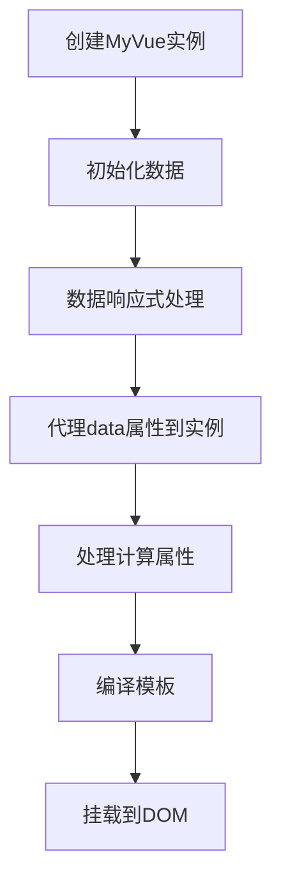

# Vue.js执行流程详解

## 整体执行流程



## 详细执行步骤

### 1. 创建MyVue实例

```javascript
const app = new MyVue({
  el: '#app',
  data: {
    name: '张三',
    message: '欢迎使用简化版Vue.js',
    count: 0
  },
  methods: {
    increment() {
      this.count++;
    },
    decrement() {
      this.count--;
    }
  }
});
```

当创建MyVue实例时，执行以下操作：

```javascript
function MyVue(options) {
  this.$options = options;           // 保存配置选项
  this.$data = options.data || {};   // 初始化数据
  
  observe(this.$data);                // 数据响应式处理
  proxy(this, '$data');               // 代理data属性到实例上
  initComputed(this);                 // 处理计算属性
  new Compiler(options.el, this);     // 编译模板
}
```

### 2. 数据响应式处理

`observe`函数遍历data对象，为每个属性创建响应式特性：

```javascript
function observe(value) {
  if (!value || typeof value !== 'object') {
    return;
  }
  return new Observer(value);
}

function Observer(value) {
  Object.keys(value).forEach(key => {
    defineReactive(value, key, value[key]);
  });
}
```

`defineReactive`函数是响应式的核心，它使用`Object.defineProperty`为每个属性添加getter和setter：

```javascript
function defineReactive(obj, key, val) {
  observe(val);                      // 递归观察子对象
  const dep = new Dep();             // 创建依赖收集器
  
  Object.defineProperty(obj, key, {
    enumerable: true,
    configurable: true,
    get() {
      // 依赖收集：当访问属性时，将当前Watcher添加到依赖列表
      Dep.target && dep.addSub(Dep.target);
      return val;
    },
    set(newVal) {
      if (newVal === val) return;
      val = newVal;
      observe(newVal);               // 新值也需要进行响应式处理
      dep.notify();                  // 通知更新
    }
  });
}
```

### 3. 代理data属性到实例

`proxy`函数将data对象的属性代理到Vue实例上，使我们可以通过`this.name`而不是`this.$data.name`来访问数据：

```javascript
function proxy(target, sourceKey) {
  const source = target[sourceKey];
  Object.keys(source).forEach(key => {
    Object.defineProperty(target, key, {
      enumerable: true,
      configurable: true,
      get() {
        return source[key];
      },
      set(newVal) {
        source[key] = newVal;
      }
    });
  });
}
```

### 4. 处理计算属性

`initComputed`函数处理计算属性，为每个计算属性创建Watcher和Dep：

```javascript
function initComputed(vm) {
  const computed = vm.$options.computed || {};
  
  Object.keys(computed).forEach(key => {
    const computedFn = computed[key];
    
    // 创建计算属性的订阅者
    const watcher = new Watcher(vm, null, function() {
      const value = computedFn.call(vm);
      watcher.value = value;
      watcher.dep.notify();  // 通知所有依赖此计算属性的订阅者更新
    });
    
    watcher.dep = new Dep();  // 为计算属性创建依赖收集器
    
    // 将计算属性定义为响应式属性
    Object.defineProperty(vm, key, {
      get() {
        if (Dep.target) {
          watcher.dep.addSub(Dep.target);
        }
        if (watcher.value === undefined) {
          watcher.value = computedFn.call(vm);
        }
        return watcher.value;
      },
      set() {
        console.warn('计算属性不能被赋值');
      }
    });
  });
}
```

### 5. 编译模板

`Compiler`类负责解析模板，识别指令和插值表达式：

```javascript
function Compiler(el, vm) {
  this.vm = vm;
  this.el = document.querySelector(el);
  this.fragment = this.node2Fragment(this.el);  // 转换为文档片段
  this.compile(this.fragment);                  // 编译模板
  this.el.appendChild(this.fragment);           // 将编译后的内容添加回DOM
}
```

编译过程：

1. **转换为文档片段**：`node2Fragment`方法将DOM元素转换为文档片段，提高操作性能
2. **编译节点**：`compile`方法遍历所有节点，根据节点类型进行不同处理
3. **处理元素节点**：`compileElement`方法处理元素节点的指令
4. **处理文本节点**：`compileText`方法处理文本节点的插值表达式

### 6. 依赖收集与更新流程

依赖收集和更新是Vue响应式的核心机制：

#### 依赖收集流程

1. 创建Watcher实例时，将`Dep.target`指向当前Watcher
2. 访问数据属性，触发getter
3. getter中将当前Watcher添加到Dep的订阅列表
4. 重置`Dep.target`

```javascript
function Watcher(vm, exp, cb) {
  this.vm = vm;
  this.exp = exp;
  this.cb = cb;
  this.value = undefined;
  
  Dep.target = this;  // 将当前订阅者指向自己
  
  if (exp) {
    this.value = this.get();  // 访问数据，触发getter，进行依赖收集
  }
  
  Dep.target = null;  // 重置Dep.target
}
```

#### 更新流程

1. 数据变化时，触发setter
2. setter中调用`dep.notify()`通知所有订阅者
3. 订阅者执行`update`方法
4. 更新视图

```javascript
// setter中的通知
set(newVal) {
  if (newVal === val) return;
  val = newVal;
  observe(newVal);
  dep.notify();  // 通知所有订阅者更新
}

// Watcher的更新方法
Watcher.prototype.update = function() {
  if (this.exp) {
    const newValue = this.get();
    const oldValue = this.value;
    if (newValue !== oldValue) {
      this.value = newValue;
      this.cb.call(this.vm, newValue, oldValue);  // 执行回调，更新视图
    }
  } else {
    this.cb.call(this.vm);
  }
};
```

## 完整示例流程

以`{{ name }}`插值表达式为例，说明完整流程：

1. **编译阶段**：
   - 编译器识别`{{ name }}`表达式
   - 创建Watcher实例，订阅name属性的变化
   - 初始化时获取name的值，显示在页面上

2. **依赖收集阶段**：
   - 创建Watcher时，将Dep.target指向当前Watcher
   - 访问name属性，触发getter
   - getter中将当前Watcher添加到name属性的Dep中
   - 重置Dep.target

3. **更新阶段**：
   - 用户修改name属性值
   - 触发name属性的setter
   - setter中调用dep.notify()通知所有订阅者
   - Watcher执行update方法
   - 更新页面上的name显示

## 总结

Vue.js的响应式系统通过以下机制实现：

1. **数据劫持**：使用Object.defineProperty为数据属性添加getter和setter
2. **依赖收集**：在getter中收集依赖，记录哪些Watcher依赖当前数据
3. **发布订阅**：在setter中通知所有依赖的Watcher进行更新
4. **模板编译**：将模板中的指令和插值表达式转换为响应式的DOM操作

这种机制确保了数据变化时视图能够自动更新，实现了数据驱动的视图渲染。