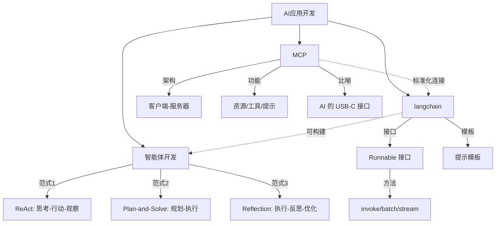

# AI应用开发

> AI 应用开发知识体系，涵盖智能体范式、开发框架与协议标准

## 核心文档

- [[智能体开发]] — 智能体开发范式详解
  - **ReAct**：Thought → Action → Observation 循环
  - **Plan-and-Solve**：先规划后执行的两阶段范式
  - **Reflection**：执行 → 反思 → 优化的自我校正循环
- [[langchain]] — LangChain 框架
  - 对话与模板（单处理 / 批处理 / 流式调用）
  - 提示模板（ChatPromptTemplate）
  - Runnable 接口（invoke / batch / stream）
- [[MCP]] — 模型上下文协议
  - 客户端-服务器架构
  - 数据层与传输层
  - 三大核心功能：资源 / 工具 / 提示

## 三种智能体范式对比

| 范式 | 核心思想 | 优势 | 局限 |
|:---:|:---:|:---:|:---:|
| ReAct | 思考→行动→观察循环 | 高可解释性、动态纠错 | 串行耗时、依赖 LLM 能力 |
| Plan-and-Solve | 先规划后执行 | 适合结构化任务 | 缺乏动态调整 |
| Reflection | 执行→反思→优化 | 内部纠错、质量跃迁 | 成本高、延迟大 |

## 关联关系



## 知识脉络

```
AI 应用开发
├── 智能体范式
│   ├── ReAct（思考-行动-观察循环）
│   ├── Plan-and-Solve（先规划后执行）
│   └── Reflection（自我反思优化）
├── 开发框架
│   └── LangChain
│       ├── 模型调用（invoke / batch / stream）
│       ├── 提示模板
│       └── Runnable 标准接口
└── 协议标准
    └── MCP（模型上下文协议）
        ├── 客户端-服务器架构
        ├── 数据层（JSON-RPC）
        ├── 传输层
        └── 三大原语（资源 / 工具 / 提示）
```
