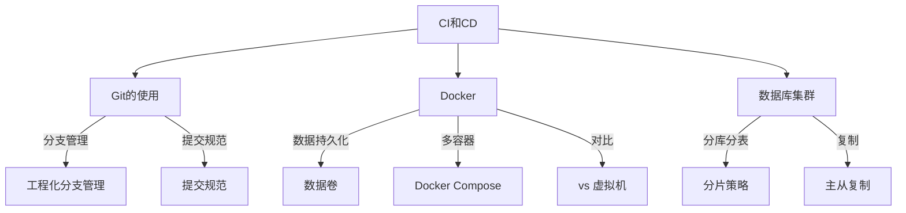

# CI和CD

> 持续集成与持续部署知识体系，涵盖版本控制、容器化与数据库

## 版本控制

- [[Git的使用]] — Git 全面使用指南
  - **基础操作**：配置、分支、仓库、同步更改
  - **代码冲突**：原因分析与解决方式
  - **提交规范**：type(scope):subject 格式（feat/fix/docs/style/refactor/perf/test/chore/revert）
  - **分支管理**：master / develop / feature / release / hotfix 工作流

## 容器化

- [[Docker]] — Docker 容器化平台
  - **核心概念**：镜像、容器、Docker Engine
  - **Dockerfile**：镜像构建流程描述
  - **数据卷**：Volume / Bind Mount / tmpfs 三种存储方式
  - **Docker Compose**：多容器编排工具

## 数据库

- [[数据库集群]] — 分库分表与主从复制
  - **分片策略**：Hash / Range / 一致性Hash / 按业务ID
  - **主从复制**：Master 写 Binlog → Slave IO 线程 → Relay Log → SQL Thread 执行

## 关联关系



## 知识脉络

```
CI和CD
├── 版本控制
│   └── Git（配置 / 分支 / 仓库 / 同步 / 冲突 / 提交规范 / 分支管理）
├── 容器化
│   └── Docker（镜像 / 容器 / Dockerfile / 数据卷 / Compose）
└── 数据库
    └── 数据库集群（分库分表 / 主从复制）
```

## 跨模块关联

| 关联模块 | 关联点 |
|:--------|:------|
| [[前端知识]] 工程化 | Git 提交规范、分支管理策略 |
| [[前端知识]] 工程化 | Docker 部署前端应用 |
| [[计算机基础]] 网络 | Docker 容器网络、数据库主从复制通信 |
| [[后端知识]] Python | Docker 部署 Python 应用 |
