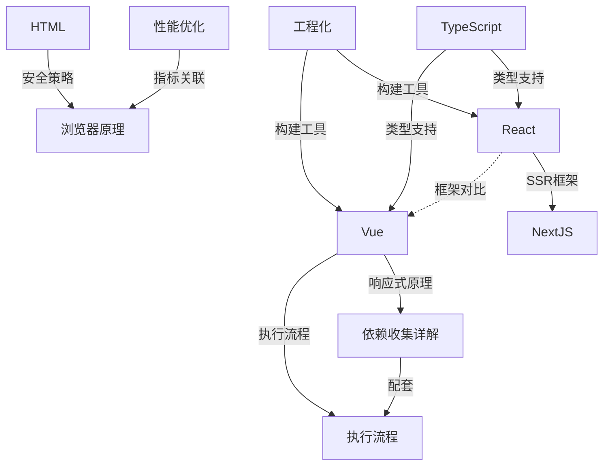

# 前端知识

> 前端开发核心知识体系，涵盖框架、语言、原理、工程化与场景实现

## 框架

### Vue 生态

- [[Vue]] — Vue 框架核心：应用创建、组件、响应式、生命周期、指令
- [[依赖收集详解]] — Vue 响应式系统中模板编译与依赖收集的深度解析
- [[执行流程]] — Vue 实例从创建到渲染的完整执行流程
- [Vue响应式实现](../场景/vue响应式更新的原理/Vue/README.md) — 简化版 Vue.js 的手写实现

### React 生态

- [[React]] — React 核心：Fiber 架构、JSX、组件、Hooks、Diff 算法、Redux
- [[NextJS]] — Next.js 框架：SSR / CSR / SSG、文件系统路由、项目结构

### 框架关联

- React 与 Vue 的 Diff 算法对比（见 [[React]] 文档内）
- React 单向数据流 vs Vue 双向绑定（见 [[Vue]] 与 [[React]]）
- [[NextJS]] 是 [[React]] 的 SSR 框架扩展

## 语言基础

- [[TypeScript]] — TS 类型系统：类型注解、接口、泛型、高级类型、工具类型、React 中使用 TS
- [[HTML]] — HTML 元素：iframe、CSP 安全策略、同源策略、CORS、CSRF
- [[CSS]] — CSS 基础（待补充）

## 性能与原理

- [[性能优化]] — 前端性能指标：FP / FCP / LCP / FID / TTI / CLS
- [[浏览器原理]] — 浏览器工作原理

## 工程化

- [[工程化]] — 模块化（CJS / ESM）、Webpack、Vite、Tree Shaking、代码分割、热更新
- [[开发文档]] — 组件库开发：样式方案、色彩系统、Tree / Button 组件设计

## 场景实现

- [Vue响应式-README](../场景/vue响应式更新的原理/Vue/README.md) — 简化版 Vue.js 实现
- [[依赖收集详解]] — 模板编译与依赖收集深度解析
- [[执行流程]] — Vue.js 完整执行流程
- [消息队列-README](../场景/消息队列/README.md) — JavaScript 消息队列实现（发布订阅 + 生产者消费者）
- [Promise-notes](../场景/Promise/notes.md) — Promise A+ 规范笔记

## 关联关系

## 跨模块关联

- 浏览器请求过程 → [[计算机网络]]（DNS解析 → TCP握手 → HTTP请求 → 渲染）
- HTTP 缓存 → [[性能优化]]（304状态码、Keep-Alive）
- Webpack 热更新 WebSocket → [[计算机网络]]
- TS 类型系统 → [[设计模式]] 代码示例使用 TypeScript
