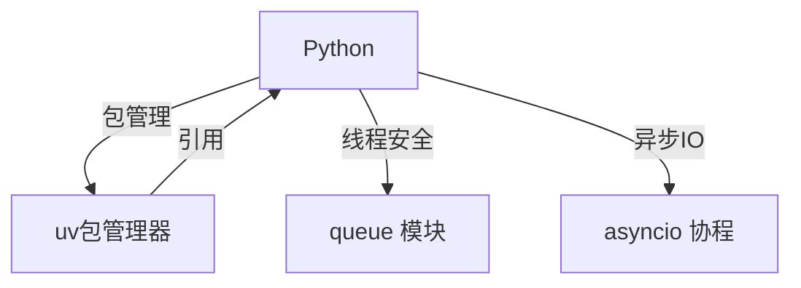

# 后端知识

> 后端开发知识体系，涵盖 Python 语言与包管理

## Python 语言

- [[Python]] — Python 全面总结
  - **常见库**：typing（类型提示）、dataclasses（数据类）、time（时间）、queue（线程安全队列）
  - **面向对象**：类、继承、方法重写、私有属性/方法、垃圾回收机制
  - **多线程**：threading 模块、Thread 类、线程同步（Lock / RLock）、线程优先级队列
  - **协程**：asyncio、事件循环（Event Loop）、Task、Future、同步原语

## 包管理

- [[uv包管理器]] — Python uv 包管理工具
  - 项目创建（`uv init`）、依赖管理（`uv add` / `uv remove`）
  - 虚拟环境（`uv venv`）、运行命令（`uv run`）、构建分发包（`uv build`）

## 关联关系



## 知识脉络

```
后端知识
├── Python
│   ├── 常见库（typing / dataclasses / time / queue）
│   ├── 面向对象（类 / 继承 / 多线程 / 线程同步）
│   └── 协程（asyncio / Event Loop / Task / Future）
└── uv 包管理器（项目创建 / 依赖管理 / 虚拟环境 / 构建）
```

## 跨模块关联

- Python 协程的异步理念与 JavaScript 的 Promise/async-await 相通 → [[前端知识]] 场景实现
- Python typing 与 [[TypeScript]] 类型系统理念相似
