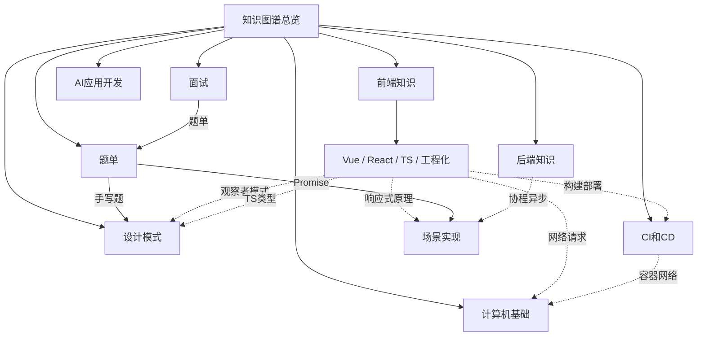

# 知识图谱总览

> 本文件是整个项目知识图谱的入口节点（MOC - Map of Content）。
> 在 Obsidian 中打开本目录作为 Vault，即可通过图谱视图查看所有文档的关联关系。

## 七大模块导航

| 模块 | 导航 | 文档数 | 核心内容 |
|:---:|:-----|:-----:|:--------|
| 前端知识 | [[前端知识]] | 16 | Vue / React / NextJS / TS / HTML / CSS / 性能优化 / 浏览器原理 / 工程化 / 场景实现 |
| 后端知识 | [[后端知识]] | 2 | Python / uv 包管理器 |
| 计算机基础 | [[计算机基础]] | 1 | 计算机网络（OSI / TCP / HTTP / DNS / WebSocket） |
| 面试 | [[面试]] | 1 | 算法题单（50题）+ 手写题 |
| 设计模式 | [[设计模式]] | 6 | 创建型 / 结构型 / 行为型设计模式 |
| AI应用开发 | [[AI应用开发]] | 3 | 智能体开发 / LangChain / MCP |
| CI和CD | [[CI和CD]] | 3 | Git / Docker / 数据库集群 |

## 算法题单

所有算法与手写题已合并整理至 **[[题单]]**，包含动态规划、回溯、二叉树、ACM模式、Hot100、手写题共 50 道题目。

## 全局文档索引

### 前端知识

- [[Vue]] — Vue 框架核心知识
- [[React]] — React 框架核心知识（Fiber / Hooks / Diff）
- [[NextJS]] — Next.js 框架（SSR / CSR / SSG）
- [[TypeScript]] — TypeScript 类型系统
- [[HTML]] — HTML 元素与安全策略
- [[CSS]] — CSS 基础
- [[性能优化]] — 前端性能指标（LCP / FID / CLS）
- [[浏览器原理]] — 浏览器工作原理
- [[工程化]] — 前端工程化（Webpack / Vite / 模块化）
- [[开发文档]] — 组件库开发文档
- [[依赖收集详解]] — Vue 模板编译与依赖收集
- [[执行流程]] — Vue.js 执行流程详解

### 后端知识

- [[Python]] — Python 语法 / 面向对象 / 多线程 / 协程
- [[uv包管理器]] — Python uv 包管理工具

### 计算机基础

- [[计算机网络]] — 网络分层 / TCP/UDP / HTTP/HTTPS / DNS / WebSocket

### 面试

- [[题单]] — 算法与手写题合并题单（50题）

### 设计模式

- [[设计模式]] — 设计模式总览
- [[单例模式]] — 创建型：单例模式
- [[工厂模式]] — 创建型：工厂模式
- [[生成器模式]] — 创建型：生成器模式
- [[适配器模式]] — 结构型：适配器模式
- [[装饰模式]] — 结构型：装饰模式

### AI应用开发

- [[智能体开发]] — ReAct / Plan-and-Solve / Reflection
- [[langchain]] — LangChain 框架
- [[MCP]] — 模型上下文协议

### CI和CD

- [[Git的使用]] — Git 版本控制
- [[Docker]] — Docker 容器化
- [[数据库集群]] — 分库分表 / 主从复制

## 核心关联关系

## 如何使用

1. **在 Obsidian 中打开**：将 `D:\project\learn-front` 文件夹作为 Vault 打开
2. **查看图谱**：点击左侧"图谱"图标，即可看到所有文档的可视化关联网络
3. **导航**：从本文件出发，点击任意 `[[双链]]` 跳转到对应文档
4. **查看题单**：点击 [[题单]] 查看合并后的全部算法与手写题
5. **扩展**：在任意文档中添加 `[[文档名]]` 即可建立新的关联关系

## 模块间跨关联速查

| 来源模块 | 目标模块 | 关联内容 |
|:--------|:--------|:--------|
| 前端知识 | 计算机基础 | 浏览器请求过程、HTTP缓存、同源策略 |
| 前端知识 | 设计模式 | Vue响应式=观察者模式、React HOC=装饰模式 |
| 前端知识 | CI和CD | 工程化分支管理、Docker部署 |
| 面试 | 设计模式 | 手写题-发布订阅模式 |
| 面试 | 前端知识 | 手写题-Promise方法 |
| 后端知识 | 前端知识 | 协程异步理念相通 |
| CI和CD | 计算机基础 | Docker网络、数据库主从复制通信 |
