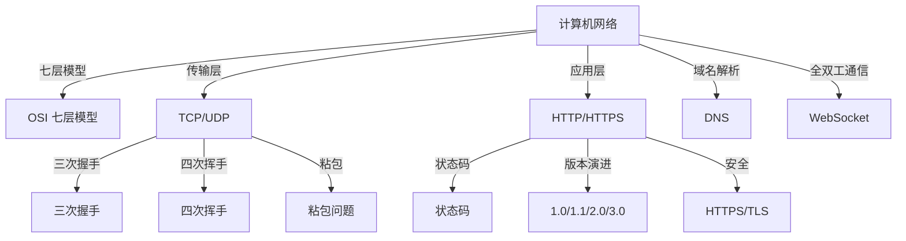

# 计算机基础

> 计算机基础理论知识体系

## 网络基础

- [[计算机网络]] — 计算机网络全面总结
  - **网络模型**：OSI 七层模型（物链网输会示用）、TCP/IP 四层模型
  - **传输层**：TCP vs UDP（连接方式、可靠性、流量控制、拥塞控制）
  - **TCP 连接**：三次握手与四次挥手、粘包问题
  - **应用层**：HTTP/HTTPS 协议、状态码（1xx-5xx）、版本演进（1.0/1.1/2.0/3.0）
  - **域名解析**：DNS 递归/迭代查询
  - **全双工通信**：WebSocket

## 关联关系



## 知识脉络

```
计算机基础
└── 计算机网络
    ├── 网络模型
    │   ├── OSI 七层模型
    │   └── TCP/IP 四层模型
    ├── 传输层
    │   ├── TCP（面向连接、可靠、三次握手/四次挥手）
    │   └── UDP（无连接、高效、不可靠）
    ├── 应用层
    │   ├── HTTP/HTTPS（请求响应、状态码、缓存、版本演进）
    │   ├── DNS（域名解析、递归/迭代查询）
    │   └── WebSocket（全双工通信）
    └── 安全
        ├── TLS/SSL（加密、证书、握手）
        ├── CORS（跨域资源共享）
        └── CSP（内容安全策略）
```

## 跨模块关联

| 关联模块 | 关联点 |
|:--------|:------|
| [[前端知识]] HTML | 同源策略、CORS 跨域、CSP 安全策略 |
| [[前端知识]] 浏览器原理 | 浏览器请求过程（DNS → TCP → HTTP → 渲染） |
| [[前端知识]] 性能优化 | HTTP 缓存（304状态码）、Keep-Alive 长连接 |
| [[前端知识]] 工程化 | Webpack devServer 的 WebSocket 热更新 |
| [[CI和CD]] Docker | 容器网络通信 |
| [[CI和CD]] 数据库集群 | 主从复制中的网络通信 |
