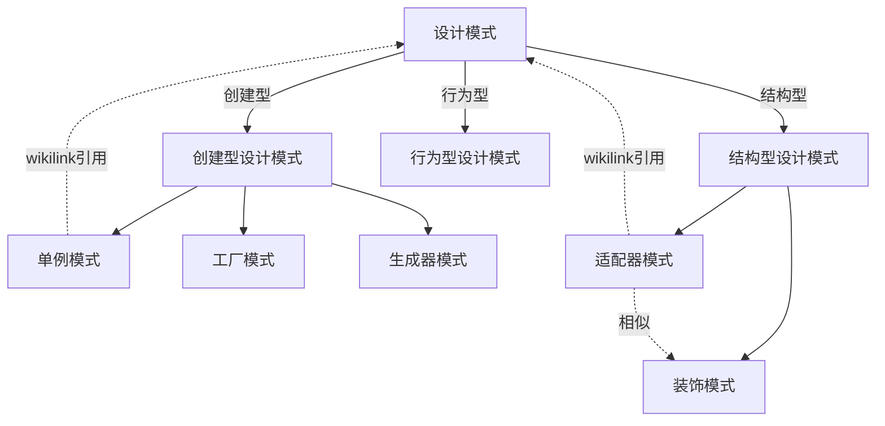

# 设计模式

> 设计模式知识体系，涵盖创建型、结构型、行为型三大类

## 总览

- [[设计模式]] — 设计模式总览，三大分类与代表模式

## 创建型设计模式

> 提供创建对象的机制，提升代码灵活性和可复用性

- [[单例模式]] — 保证一个类只有一个实例，提供全局访问节点
  - 懒汉单例 vs 饿汉单例对比
  - 线程安全问题分析（含时间轴图解）
- [[工厂模式]] — 工厂方法与抽象工厂（待补充内容）
- [[生成器模式]] — 分步骤创建复杂对象（待补充内容）

## 结构型设计模式

> 将对象和类组装成较大的结构，保持灵活和高效

- [[适配器模式]] — 使不兼容接口的对象能够相互合作
  - 含 TypeScript 完整代码示例
  - 适配器 vs 装饰模式对比
- [[装饰模式]] — 动态地为对象添加新行为，无需修改代码
  - 运行时添加/删除功能
  - 替代继承的方案

## 行为型设计模式（待补充）

> 对象间的高效沟通和职责委派

- 观察者模式（重点）
- 策略模式（重点）
- 责任链
- 命令
- 迭代器
- 状态模式

## 关联关系



## 知识脉络

```
设计模式
├── 创建型（如何创建对象）
│   ├── 单例模式（唯一实例）
│   ├── 工厂模式（工厂方法/抽象工厂）
│   ├── 生成器模式（分步构建）
│   └── 原型模式
├── 结构型（如何组合对象）
│   ├── 适配器模式（接口转换）
│   ├── 装饰模式（动态扩展）
│   ├── 代理模式
│   ├── 桥接 / 组合 / 外观 / 享元
└── 行为型（对象如何通信）
    ├── 观察者模式
    ├── 策略模式
    ├── 责任链 / 命令 / 迭代器 / 状态
    └── 中介者 / 备忘录 / 模板方法 / 访问者
```

## 跨模块关联

| 关联模块 | 关联点 |
|:--------|:------|
| [[面试]] 手写题 | 发布订阅设计模式 |
| [[前端知识]] TypeScript | 适配器模式代码使用 TypeScript |
| [[前端知识]] React | 装饰模式与 React HOC（高阶组件）理念相通 |
| [[前端知识]] Vue | Vue 响应式系统基于观察者模式（Dep/Watcher） |
