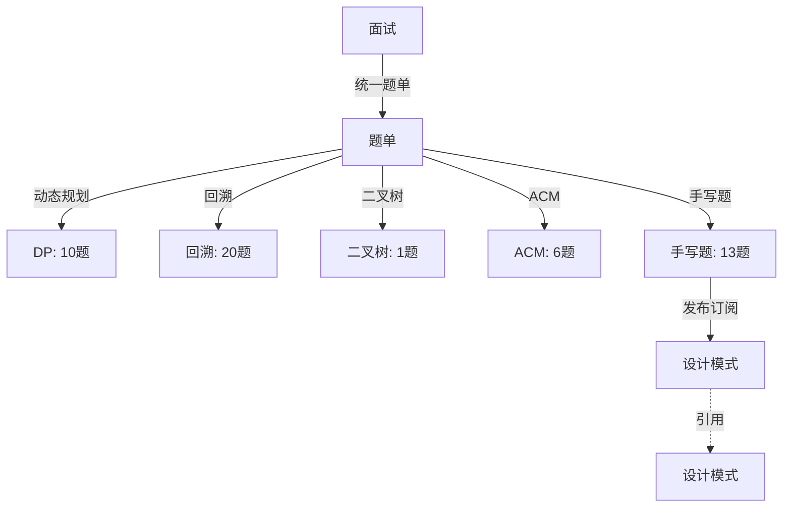

# 面试

> 面试准备知识体系，涵盖算法题单与手写题

## 算法题单

所有算法题目已合并整理至 **[[题单]]**，包含以下分类：

| 分类 | 题目数 | 核心知识点 |
|:---:|:---:|:--------|
| 动态规划 | 10 | 爬楼梯、打家劫舍、状态转移方程 |
| 回溯-子集型 | 8 | 选/不选模板、枚举模板 |
| 回溯-划分型 | 5 | 分割回文串、复原IP |
| 回溯-组合型 | 4 | 组合、括号生成 |
| 回溯-排列型 | 3 | 全排列、N皇后 |
| 二叉树 | 1 | 前序+中序构造二叉树 |
| ACM 模式 | 6 | 综合练习 |
| 手写题 | 13 | 数组/Promise/对象/工具/设计模式 |
| **合计** | **50** | |

### 重点题目（HOT100 标记）

- Leetcode_70 爬楼梯
- Leetcode_198 打家劫舍
- Leetcode_216 组合总和
- Leetcode_22 括号生成
- Leetcode_51 N皇后

## 手写题分类

| 类别 | 题目 |
|:---:|:-----|
| 数组操作 | flatten、concat |
| Promise 方法 | call、apply、all、race |
| 对象方法 | Object.create、new、instanceof |
| 工具方法 | 函数柯里化、深拷贝、防抖、节流 |
| 设计模式 | 发布订阅 |

## 原始文档索引

- [DP-README](../算法/DP/README.md) — 动态规划原始笔记
- [回溯-README](../算法/回溯/README.md) — 回溯算法原始笔记
- [二叉树-README](../算法/二叉树/README.md) — 二叉树原始笔记
- [ACM模式-README](../算法/ACM模式/README.md) — ACM 模式原始笔记
- [手写题-README](../手写题/README.md) — 手写题原始笔记
- [Hot100-README](../hot100/READE.md) — LeetCode Hot 100 记录

## 关联关系

## 跨模块关联

- 手写题中的"发布订阅设计模式" → [[设计模式]] 行为型模式
- 手写题中的 Promise 方法 → [[前端知识]] 场景实现的 [Promise-notes](../场景/Promise/notes.md)
- 算法题解使用 JavaScript → [[前端知识]] TypeScript
