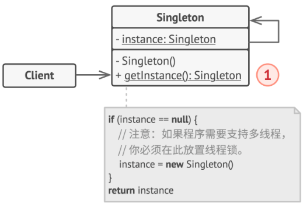

# 单例模式

**单例模式**：**保证**一个类只有一个实例对象， 并提供一个访问该实例的全局节点。

## **单例模式解决的问题**

1. **保证一个类只有一个实例**。通常用于**控制一些共享的资源**，比如数据库或者文件的访问权限。
2. **为该实例提供一个全局访问节点**。单例模式也允许在程序的任何地方访问特定对象。 但是它可以保护该实例不被其他代码覆盖。



**适用场景**

1. **如果程序中的某个类对于所有客户端只有一个可用的实例，可以使用单例模式。**
1. **如果你需要更加严格地控制全局变量，可以使用单例模式。**

## 懒汉单例 vs 饿汉单例

区别：

| 对比维度         | 饿汉单例 (Eager)          | 懒汉单例 (Lazy)                 |
| :--------------- | :------------------------ | :------------------------------ |
| **创建时机**     | 类加载/模块导入时立即创建 | 首次调用 `getInstance()` 时创建 |
| **内存占用**     | **始终占用内存**          | **按需占用内存**                |
| **启动性能**     | 启动时耗时                | 启动时快速                      |
| **首次调用性能** | 快速（实例已存在）        | 较慢（需要创建实例）            |
| **线程安全**     | 天然线程安全              | 需要手动处理                    |
| **支持参数传递** | 初始化参数无效            | 可以支持首次传参                |
| **错误处理**     | 启动时就能发现初始化错误  | 运行时才发现问题                |

**懒汉单列设计模式会存在线程不安全的情况？**

懒汉单例的线程不安全发生在**多个线程同时首次访问 `getInstance()` 方法**时，可能导致创建多个实例，利用**锁机制**进行创建。

```
// 模拟两个线程同时调用
// 时间线分析：
// T1 线程                    T2 线程
// ==================================================
// 调用 getInstance()        调用 getInstance()
// 检查 instance === null    (还未执行)
//   → true (需要创建)
//                            检查 instance === null
//                             → true (也需要创建！)
// 创建实例 A                 创建实例 B
// 返回实例 A                 返回实例 B
//
// 结果：创建了两个不同的实例！违反了单例原则


时间轴（多线程环境）：

时间 | 线程1                       | 线程2                       | instance 状态
-----|----------------------------|----------------------------|---------------
t0   | 调用 getInstance()          |                            | null
t1   | 判断 instance === null     |                            | null
t2   | 结果为 true                | 调用 getInstance()         | null
t3   | 准备创建实例                | 判断 instance === null     | null
t4   | 创建实例 A                  | 结果为 true                | null
t5   | instance = A               | 准备创建实例                | A (刚被设置)
t6   | 返回实例 A                  | 创建实例 B                  | A
t7   |                            | instance = B               | B (覆盖了！)
t8   |                            | 返回实例 B                  | B

结果：线程1拿到 A，线程2拿到 B，实例不一致！
```

```
sequenceDiagram
    participant ClientA as 请求 A (第一个)
    participant ClientB as 请求 B (并发)
    participant Singleton as AsyncSingleton
    participant DB as 外部资源 (DB/API)

    Note over ClientA, DB: 场景：三个请求几乎同时调用 getInstance()

    ClientA->>Singleton: getInstance()
    activate Singleton
    Singleton->>Singleton: 检查 instance? (null)
    Singleton->>Singleton: 检查 initPromise? (null)
    Singleton->>Singleton: 创建 initPromise = new Promise(...)
    Note right of Singleton: 🔒 “锁”已生效，状态为 Pending
    Singleton-->>ClientA: 返回该 Promise (正在等待)
    deactivate Singleton

    ClientB->>Singleton: getInstance()
    activate Singleton
    Singleton->>Singleton: 检查 instance? (null)
    Singleton->>Singleton: 检查 initPromise? (存在!)
    Note right of Singleton: ⛔ 发现“锁”，不进入初始化
    Singleton-->>ClientB: 返回相同的 initPromise (正在等待)
    deactivate Singleton

    Note over Singleton: 主线程空闲，开始执行 Promise 内的异步任务

    activate Singleton
    Singleton->>DB: await 异步初始化 (如连接数据库)
    DB-->>Singleton: 返回连接结果
    Singleton->>Singleton: 创建实例并赋值给 instance
    Singleton->>Singleton: 将 initPromise 置为 null (解锁)
    Singleton-->>ClientA: resolve(instance) ✅
    Singleton-->>ClientB: resolve(instance) ✅
    deactivate Singleton

    Note over ClientA, ClientB: 两个请求同时拿到同一个实例，只初始化了一次！
```
---

各自的使用场景
- 饿汉式单例：程序启动即创建，项目启动时就加载完毕的东西
    - 系统关键配置管理器
    - 日志记录器
    - 简单、无状态的工具类
- 懒汉式单例：首次使用时创建，按需导入，懒加载
    - 重量级资源对象：数据库连接池、线程池、大文件缓存管理器
    - 可选的功能模块
    - 启动速度敏感的应用程序